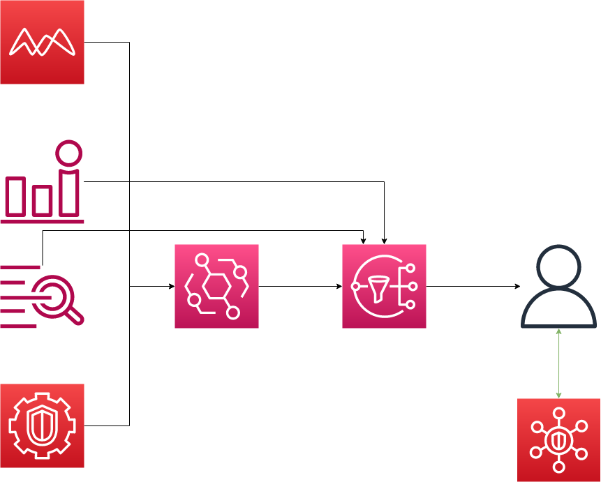

# aws-incident-response-bootstrap
AWS CDK managed infrastructure to kickstart an incident response practice.

## How to Use

Included in this repository are a number of infrastructure starting points for building an incident response program in AWS. These starting points are broken down by level of complexity starting with Level 0 (no infrastructure) and going to Level 100 (comprehensive infrastructure). 

Each level will be found in a corresponding branch with the `main` branch incorporating the most complicated infrastructure, i.e. to see the level 40 infrastructure change branch to `level40`.

Not familiar with running CDK in your account? Check out [the CDK Documentation section][#CDK]

### Level 0

No incident response infrastructure.

Congrats, you already have this deployed in your AWS account. In fact, you already have a very sophisticated CI/CD deployment of this in your account on behalf of the fine folks at AWS. AWS will email your root email address if it detects any particularly malicious behavior happening in your account, hope you're checking that email!  

### Level 20


Just a GuardDuty detector. Let AWS do the work of monitoring your account. Right now, you won't be alerted at all, but you would at least be doing some monitoring. Maybe set a regular alarm to go check if there're any findings for your account.

### Level 40


GuardDuty -> Eventbridge -> SNS -> You.

We take the infrastructure of Level 20 and add in notifications to the deal. Now, GuardDuty will find out about happenings in your account and you can send these to an email address. 

### Level 60



Go beyond GuardDuty. Add in Custom Cloudwatch Events to SNS to you. Give your team the ability to leverage SecurityHub for a sort of security health dashboard.

Here, we start thinking about what other custom events could warrant notifications to our main SNS topic. I use the example of anomalous lambda invocations as a possible metric we'd like to be notified on. 

Additionally, we now introduce our first "end-user" tool for incident response: SecurityHub. Out of the box, this security posture management tool already gives you some sense of how "secure" your AWS environment is based upon a number of standards (though, with heavy opinionation by AWS), but also allows for integration with many third parties both on the detection (i.e. findings) side and the response side. 

### Level 80


## CDK

The `cdk.json` file tells the CDK Toolkit how to execute your app.

This project is set up like a standard Python project.  The initialization
process also creates a virtualenv within this project, stored under the `.venv`
directory.  To create the virtualenv it assumes that there is a `python3`
(or `python` for Windows) executable in your path with access to the `venv`
package. If for any reason the automatic creation of the virtualenv fails,
you can create the virtualenv manually.

To manually create a virtualenv on MacOS and Linux:

```
$ python3 -m venv .venv
```

After the init process completes and the virtualenv is created, you can use the following
step to activate your virtualenv.

```
$ source .venv/bin/activate
```

If you are a Windows platform, you would activate the virtualenv like this:

```
% .venv\Scripts\activate.bat
```

Once the virtualenv is activated, you can install the required dependencies.

```
$ pip install -r requirements.txt
```

At this point you can now synthesize the CloudFormation template for this code.

```
$ cdk synth
```

To add additional dependencies, for example other CDK libraries, just add
them to your `setup.py` file and rerun the `pip install -r requirements.txt`
command.

### Useful commands

 * `cdk ls`          list all stacks in the app
 * `cdk synth`       emits the synthesized CloudFormation template
 * `cdk deploy`      deploy this stack to your default AWS account/region
 * `cdk diff`        compare deployed stack with current state
 * `cdk docs`        open CDK documentation

Enjoy!
